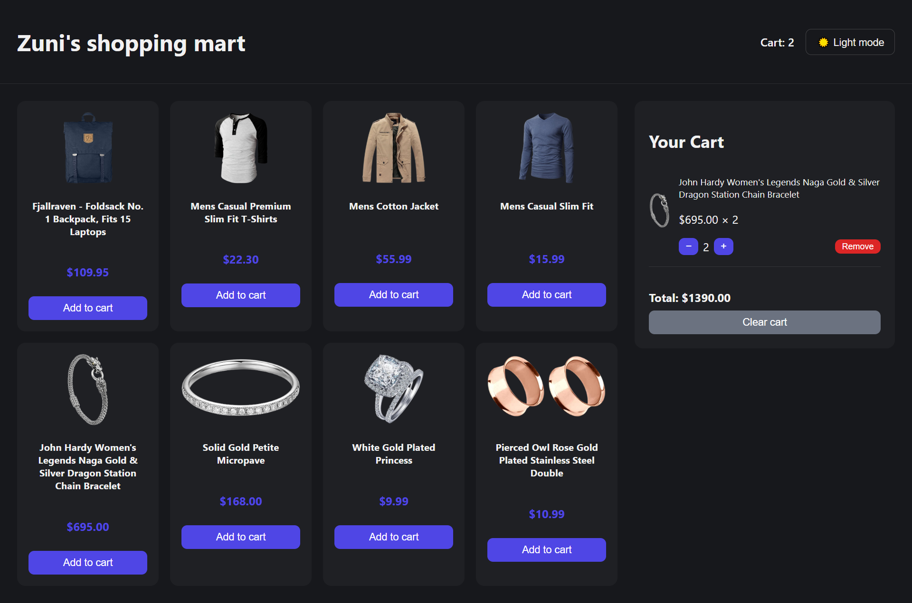

# 🛍️ Zuni's Shopping Mart

A React shopping cart application built to practice **Context API** and **Redux Toolkit** for state management.

The project uses **Context API for theme management** and **Redux Toolkit for product and cart state**, including asynchronous API requests with `createAsyncThunk`.

---

## Features

* Fetches products from the Fake Store API
* Add products to the cart
* Increase or decrease item quantity
* Remove individual items
* Clear the entire cart
* Automatically calculates cart total
* Displays the total number of cart items
* Toggle between light and dark mode
* Handles API loading and error states

---

## Preview

### Light Mode


### Dark Mode



---
## State Management

This project demonstrates two different approaches to managing React state:

### Context API

Used for **theme management**.

`ThemeContext` provides:

* Current theme (`light` / `dark`)
* `toggleTheme()` function
* `useTheme()` custom hook

This keeps simple UI-level state separate from the application's main data.

### Redux Toolkit

Used for **products and shopping cart state**.

The Redux store contains two slices:

**`productsSlice`**

* Fetches products using `createAsyncThunk`
* Stores product data
* Tracks `idle`, `loading`, `succeeded`, and `failed` states
* Handles API errors

**`cartSlice`**

* Adds and removes products
* Updates quantities
* Clears the cart
* Calculates cart count and total using selectors

---

## API

Products are fetched from the **Fake Store API**:

```text
https://fakestoreapi.com/products?limit=8
```

The request is handled through Redux Toolkit's `createAsyncThunk`, with loading and error states managed inside `productsSlice`.

---

## Tech Stack

* **React 19**
* **Vite**
* **JavaScript (ES6+)**
* **Redux Toolkit**
* **React Redux**
* **Context API**
* **Fake Store API**
* **Oxlint**

---

## Getting Started

### 1. Clone the repository

```bash
git clone https://github.com/zuni-developer/Context-API-Redux-Toolkit.git
```

### 2. Navigate to the project

```bash
cd Context-API-Redux-Toolkit
```

### 3. Install dependencies

```bash
npm install
```

### 4. Start the development server

```bash
npm run dev
```

Open the local URL provided by Vite, usually:

```text
http://localhost:5173
```

---

## Available Scripts

```bash
npm run dev       # Start development server
npm run build     # Create production build
npm run preview   # Preview production build
npm run lint      # Run Oxlint
```
